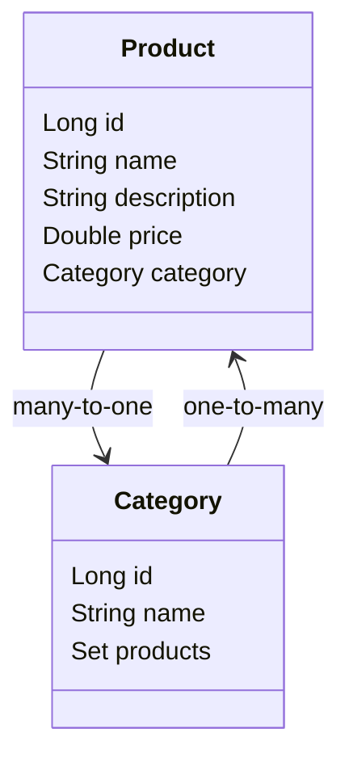

# 🛒 Product API

Uma API RESTful desenvolvida com **Spring Boot** para gerenciar produtos e categorias, com foco em boas práticas, tratamento global de exceções, DTOs e estrutura limpa.

---

## 📚 Diagrama de Classes (UML)

## 📦 Funcionalidades

- ✅ Cadastro, listagem, atualização e remoção de **produtos**
- ✅ Cadastro, listagem, atualização e remoção de **categorias**
- ✅ Relacionamento `Product → Category` (`@ManyToOne`)
- ✅ Tratamento global de exceções (`@RestControllerAdvice`)
- ✅ Separação de `DTO` para entrada e saída
- ✅ Documentação com Swagger (em breve)
- ✅ Pronto para autenticação com JWT (futuro módulo)

---

## 🚀 Tecnologias utilizadas

- Java 17
- Spring Boot 3.x
- Spring Data JPA
- H2 (para testes locais) ou PostgreSQL (produção)
- Swagger / Springdoc OpenAPI
- Maven

---
